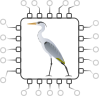

# Heron Core

Being a compiler, emulator, and hardware description for _Heron_ --- a special
purpose processor core for pure, non-strict functional languages.

<p align="center" width="100%">
    
</p>

We consider this a spiritual successor to the [Reduceron
project](https://mn416.github.io/reduceron-project/), extending their ideas around
FPGA implementation of a template instantiation machine. The bulk of the
compiler is a modified version of their F-lite compiler, while the hardware
description is completely reimplemented in [Clash](https://clash-lang.org/).

## Building

We package all components in a single [nix
flake](https://nixos.wiki/wiki/Flakes). If you have nix installed, nix flakes
enabled, and Xilinx Vivado on your `PATH`, the nix environment here will
configure everything else needed.

Clone this repo and then use `nix build` to reproduce any of Heron's components:

  + F-lite compiler --- a translator from the high-level source language,
    [F-lite](https://hackage.haskell.org/package/flite), to Heron graph
    templates. The output binaries will be linked in the `result/` folder.

    ``` nix build .#flite ```

  + Heron emulator --- a "fast" emulation of the hardware behaviour, implemented
    in C. This is an extension of Reduceron's emulator. Usually you'd want both
    of the above (maybe `nix shell -p .#flite .#heron-emu`) so you can compile
    an F-lite program and then emulate the resulting template representation.

    ``` nix build .#heron-emu ```

  + Heron hardware description written in Clash. This is a (compile-time)
    parameterised description of the sequential Heron Core processor. The build
    process generates a Verilog netlist for the core, which can then be
    implemented via the board-specific `heron-alveo` or `heron-ultra96` targets.

    ``` nix build .#heron-clash ```

  + An implementation of Heron for the Alveo U280 board. Currently a raw design
    with pins exposed via device IOBs. Since this relies on Vivado for synthesis
    and implementation, we need to use nix's `--no-sandbox` and `--impure` flags
    to allow the build environment access to a global Vivado install (make sure
    it's on your path before building...).

    ```nix build .#heron-alveo --no-sandbox --impure```

  + An alternative implementation of Heron for the Ultra96 board with
    interactivity via PYNQ. This is a much smaller/slower device, but the
    current implementation does offer software control for loading custom
    programs and retrieving results.

    ```nix build .#heron-ultra96 --no-sandbox --impure```

All dependencies (except Vivado) are handled through nix, so feel free to jump
straight to building `heron-alveo`.

## Development

Normal nix flake rules apply for development. Enter a development environment
for any build target with ```nix develop .#<target>``` (omitting the target will
default to `heron-clash`). The target's commands for building, checking, and
installing can be retrieved via the env variables `buildPhase`, `checkPhase`, or
`installPhase` respectively. Both `F-lite` and `heron-clash` are packaged as
cabal packages under the nix hood. You might find the standard `cabal` commands
easier for interactive development once in a development environment. For
example:

```
user@pc:~/heron$ nix develop .#heron-clash
user@pc:~/heron$ cabal repl heron
ghci> :l Heron.Core.Board
ghci>
```

We can perform testing with `cd hdl; cabal test`, or generate documentation with
`cd hdl; cabal haddock`.

## License

Our project license is currently GPL 2.0. See [LICENSE](./LICENSE) for details.

