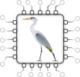

# Heron Core

Being a compiler, emulator, and hardware description for _Heron_ --- a special
purpose processor core for pure, non-strict functional languages.

<p align="center" width="100%">
    
</p>

We consider this a spiritual successor to the [Reduceron
project](https://mn416.github.io/reduceron-project/), extending their ideas around
FPGA implementation of a template instantiation machine. The bulk of the
compiler is a modified version of their F-lite compiler, while the hardware
description is completely reimplemented in [Clash](https://clash-lang.org/).

## Building

We package all components in a single [nix
flake](https://nixos.wiki/wiki/Flakes). If you have nix installed, nix flakes
enabled, and Xilinx Vivado 2023.1 on your `PATH`, the nix environment here will
configure everything else needed.

### Dependencies

Install the __single-user version__ of the nix package manager by following the
instructions [here](https://nixos.org/download/).

You'll also need to enable nix's `flake` feature with:

```
echo "experimental-features = nix-command flakes" >> ~/.config/nix/nix.conf
```

To build images for any of the FPGA targets, you'll also need to install Vivado
and ensure it's available from your `$PATH` environment. This repo expects [Vivado
2023.1](https://www.xilinx.com/support/download/index.html/content/xilinx/en/downloadNav/vivado-design-tools/archive.html),
but other versions should work with minor modification.

## Building Heron

Clone this repo and then use `nix` commands to reproduce any of Heron's
components. The `nix build <target>` command will leave the results in a
`./result` directory. `nix shell <target>` does the same but will put any
resulting binaries on your `$PATH`. `nix develop <target>` only generates the
dependencies for the component --- useful for interactive development.

### Utilities

There are a few utility packages for Heron's source language and emulation.

`.#flite` target
: The F-lite compiler --- a translator from the high-level source language,
  [F-lite](https://hackage.haskell.org/package/flite), to Heron graph templates.
  Example: `flite -r6:4:2:1:2:16 -h3 -i1 -s -p flite/examples/large/adjoxo.fl`
  will compile the `adjoxo` benchmark to human readable(ish) templates using the
  default Heron configuration. See `flite -h` for options.

`.#heron-emu` target
: A "fast" emulator for Heron's mutator, implemented in C. It is a
  cycle-accurate simulation of Heron's mutator (but the GC behaviour is
  different). Example: with both `.#flite` and `.#heron-emu` available (e.g.
  after `nix shell .#flite .#heron-emu`), you can compile and emulate the
  `adjoxo` benchmark with `flite -r6:4:2:1:2:16 -h3 -i1 -s
  flite/examples/large/adjoxo.fl | emu -n4 -v -`. See `emu -h` for options.

### Hardware design

The main hardware description for Heron.

`.#heron-clash` target
: Heron's hardware description written in Clash. The build process generates a
  set of verilog files for the core, which can then be implemented via the
  board-specific `heron-{alveo,ultra96,pynqz2-vio}` targets. It also supplies a
  `heron` binary which can be used to simulate the design or generate binary
  template files. Example: generate a binary file for the `adjoxo` benchmark
  with `heron -d flite/examples/large/adjoxo.fl > /tmp/adjoxo.bin`. See `heron -h`
  for options.

`.#heron-verilated` target
: A [verilator](https://verilator.org/guide/latest/) wrapper for Heron's verilog
  output. This compiles the Heron verilog description into C, enabling faster
  simulation than using Clash directly. Example: with both `.#heron-clash` and
  `.#heron-verilated` (e.g. `nix shell .#heron-clash .#heron-verilated`), we can
  compile the `adjoxo` benchmark and simulate it with `heron -d
  flite/examples/large/adjoxo.fl > /tmp/adjoxo.bin; heron-verilated
  /tmp/adjoxo.bin`.

### FPGA targets

We support a few different FPGA boards. Since these builds require access to
Vivado (usually installed without nix) you need to pass some extra commands when
building: e.g. `nix build .#heron-pynqz2-vio --impure --no-sandbox`.

I've had some issues with Ubuntu 24.04's apparmor configuration causing `bwrap`
errors (`bwrap: setting up uid map: Permission denied`) when building these
targets. A sledgehammer approach to avoid this is to temporarily disable it via
`sudo sysctl -w kernel.apparmor_restrict_unprivileged_userns=0` (obviously very
dangerous, but it works).

`.#pynqz2-vio` target
: An implementation for the [PYNQ-Z2
  board](https://www.tulembedded.com/FPGA/ProductsPYNQ-Z2.html) (also compatible
  with PYNQ-Z1). Make sure Vivado has access to its [board
  files](https://dpoauwgwqsy2x.cloudfront.net/Download/pynq-z2.zip). This design
  includes Xilinx's [VIO
  core](https://www.xilinx.com/products/intellectual-property/vio.html), so we
  can interact with the Heron processor over JTAG. The vio scripts expect the
  [cable drivers
  installed](https://digilent.com/reference/programmable-logic/guides/install-cable-drivers)
  to be installed, a PYNQ-Z2 board to be plugged in via USB, and the board has
  been fully booted (LEDs 0--5 should flash when this happens). Example: you can
  send a program to the Heron processor with `heron -d
  flite/examples/large/adjoxo.fl > /tmp/adjoxo.bin; run-vio /tmp/adjoxo.bin`.
  This will load the bitstream onto the FPGA, send the template binary through
  the VIO core, and report the results.

`.#heron-alveo` target
: An implementation of Heron for the Alveo U280 board. Currently a raw design
  with pins exposed via device IOBs. This is difficult to interact with, but is
  very useful for reporting the maximum achievable clock frequency and resource
  usage statistics.

`.#heron-ultra96` target
: An implementation of Heron for the Ultra96 board with interactivity via
  PYNQ/Jupyter notebooks. This is marked as broken for now. The design uses
  Vivado's IPI block diagrams, which disallow verilog `x` values. Recently,
  builds avoiding 'x' values have caused Vivado segfaults in Ubuntu 24.04 and I
  haven't managed to debug this yet... Steer clear.

## Development

Normal nix flake rules apply for development. Enter a development environment
for any build target with ```nix develop <target>``` (omitting the target will
default to `.#heron-clash`). The target's commands for building, checking, and
installing can be retrieved via the env variables `buildPhase`, `checkPhase`, or
`installPhase` respectively. Both `F-lite` and `heron-clash` are packaged as
cabal packages under the nix hood. You might find the standard `cabal` commands
easier for interactive development once in a development environment. For
example:

```
user@pc:~/heron$ nix develop .#heron-clash
user@pc:~/heron$ cabal repl heron
ghci> :l Heron.Core.Board
ghci>
```

We can perform testing with `cd hdl; cabal test`, or generate documentation with
`cd hdl; cabal haddock`.

## License

Our project license is currently GPL 2.0. See [LICENSE](./LICENSE) for details.

