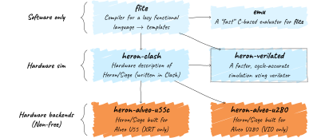
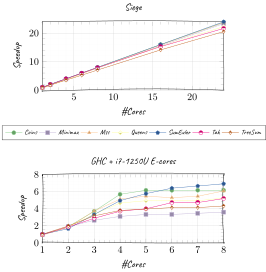
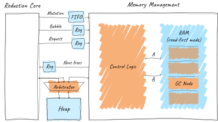
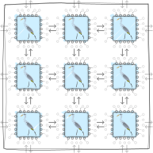
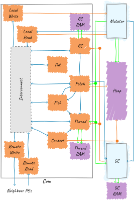

# Siege/Heron Core

Being a compiler, emulator, and hardware description for _Siege_ and _Heron_ --- special
purpose processors for pure, non-strict functional languages.

Heron
: A dubious partial portmanteau of "Heriot-Watt
  [Reduceron](https://mn416.github.io/reduceron-project/)", and a little single
  core processor.

Siege
: The collective noun for Herons, and a multi-core, distributed-memory system.

<p align="center" width="100%">
    
</p>

We consider this a spiritual successor to the [Reduceron
project](https://mn416.github.io/reduceron-project/) --- we extend their
single-core ideas, modernise some things, and apply the result to parallel
programming. The bulk of the compiler is a modified version of their F-lite
compiler, while The hardware description with [Clash](https://clash-lang.org/)
is completely new.

This is a _hardware_ project, so some FPGA hardware and non-free vendor tooling
is needed for deployment. We offer a set of tools (see below) so you can
evaluate the system with just free software, but hardware sim times will be
_rough_.

<p align="center" width="100%"> </p>

## Architecture

There are a couple of papers that detail our design. The first talks about our
[single-core
mutator](https://researchportal.hw.ac.uk/en/publications/heron-modern-hardware-graph-reduction/),
the second details our [garbage
collection](https://dl.acm.org/doi/10.1145/3677999.3678277), and the third (not
yet published) will extend those topics into a multi-core design that has quite
nice speedups. Here's a sneak peek.

<p align="center" width="100%"></p>

Heron's mutator does all the work of evaluating a program. It's quite simple and is joined by a GC unit that does mark-and-sweep collection almost completely in the background.

<p align="center" width="100%"></p>

Siege extends this into a scalable multi-core system.
It lets us compose cores into a 2D mesh of homogenous, distributed-memory
processors. The scaling is surprisingly good, compared to GHC.

<p align="center" width="100%"> </p>

The step towards multi-core requires a pretty hefty communication/scheduling
unit that is about as complex as either the mutator or GC. The nice thing is
that this is mostly an _addition_ --- the existing cores don't need major
redesigns.

<p align="center" width="100%"> </p>

## Dependencies

We package all components in a single [nix
flake](https://nixos.wiki/wiki/Flakes).

Install the nix package manager by following the instructions
[here](https://nixos.org/download/). You'll also need to enable nix's `flake`
feature by adding a line to `~/.config/nix/nix.conf`:

```
experimental-features = nix-command flakes
```

You probably want to enable some binary caches for nix, avoiding rebuilding
_everything_ from source, by adding some additional lines to
`~/.config/nix/nix.conf`:

```
substituters = https://nix-community.cachix.org https://clash-lang.cachix.org https://cache.nixos.org
trusted-public-keys = nix-community.cachix.org-1:mB9FSh9qf2dCimDSUo8Zy7bkq5CX+/rkCWyvRCYg3Fs= clash-lang.cachix.org-1:/2N1uka38B/heaOAC+Ztd/EWLmF0RLfizWgC5tamCBg= cache.nixos.org-1:6NCHdD59X431o0gWypbMrAURkbJ16ZPMQFGspcDShjY=
```

To build images for any of the FPGA targets, you'll also need to install Vivado
and ensure it's available from your `$PATH` environment. This repo expects
[Vivado
2024.2](https://www.xilinx.com/support/download/index.html/content/xilinx/en/downloadNav/vivado-design-tools/archive.html),
but other versions should work with minor modification.

## Building Heron

Clone this repo and then use `nix` commands to reproduce any of Heron's
components. The `nix build <target>` command will leave the results in a
`./result` directory. `nix shell <target>` does the same but will put any
resulting binaries on your `$PATH`. `nix develop <target>` only generates the
dependencies for the component --- useful for interactive development.

### Utilities

There are a few utility packages for Heron's source language and emulation.

`.#flite` target
: The F-lite compiler --- a translator from the high-level source language,
  [F-lite](https://hackage.haskell.org/package/flite), to Heron graph templates.
  
> Example: `flite -r6:4:2:1:2:16 -h3 -i1 -s -p flite/examples/large/adjoxo.fl`
  will compile the `adjoxo` benchmark to human readable(ish) templates using the
  default Heron configuration. See `flite -h` for options.

`.#heron-emu` target
: A "fast" emulator for Heron's single-core mutator, implemented in C. It is a
  cycle-accurate simulation of Heron's mutator (but the GC behaviour is
  different).
  
> Example: with both `.#flite` and `.#heron-emu` available (e.g. after `nix
  shell .#flite .#heron-emu`), you can compile and emulate the `adjoxo`
  benchmark with `flite -r6:4:2:1:2:16 -h3 -i1 -s flite/examples/large/adjoxo.fl
  | emu -n4 -v -`. See `emu -h` for options.

### Hardware design

The main hardware description for Heron.

`.#heron-clash` target
: Siege/Heron's hardware description written in Clash. The build process
  generates a set of verilog files for the core, which can then be implemented
  via the board-specific `heron-alveo-{u55,u280} targets. It also supplies a
  `heron` binary which can be used to simulate the design or generate binary
  template files.
  
> Example: generate a binary file for the `adjoxo` benchmark with `heron -d
  flite/examples/large/adjoxo.fl > /tmp/adjoxo.bin`. See `heron -h` for options.

`.#heron-verilated` target
: A [verilator](https://verilator.org/guide/latest/) wrapper for Heron's verilog
  output. This compiles the Heron verilog description into C, enabling faster
  simulation than using Clash directly.
  
> Example: with both `.#heron-clash` and
  `.#heron-verilated` (e.g. `nix shell .#heron-clash .#heron-verilated`), we can
  compile the `adjoxo` benchmark and simulate it with `heron -d
  flite/examples/large/adjoxo.fl > /tmp/adjoxo.bin; heron-verilated
  /tmp/adjoxo.bin`.

### FPGA targets

We support a few different FPGA boards. Since these builds require access to
Vivado (usually installed without nix) you need to pass some extra commands when
building: e.g. `nix build .#heron-alveo-u280 --impure --no-sandbox`.

I've had some issues with Ubuntu 24.04's apparmor configuration causing `bwrap`
errors (`bwrap: setting up uid map: Permission denied`) when building these
targets. A sledgehammer approach to avoid this is to temporarily disable it via
`sudo sysctl -w kernel.apparmor_restrict_unprivileged_userns=0` (obviously very
dangerous, but it works).

`.#heron-alveo-u280` target
: An implementation for the Alveo U280 board. Currently a raw design
  with pins exposed via device IOBs. This is difficult to interact with, but is
  very useful for reporting the maximum achievable clock frequency and resource
  usage statistics.

`.#heron-alveo-u55` target
: An implementation Heron for Alveo U55C using XRT bindings. This is practical
  --- deployment and interaction on cloud services is much easier.
  
> Warning: This is not ideal though. The XRT shell uses up some of the FPGA
  resources. Even worse, the regions available to us aren't very regular, so
  floorplanning becomes a headache. We often use this for running our examples,
  but with a slower clock.

## Development

Normal nix flake rules apply for development. Enter a development environment
for any build target with ```nix develop <target>``` (omitting the target will
default to `.#heron-clash`). The target's commands for building, checking, and
installing can be retrieved via the env variables `buildPhase`, `checkPhase`, or
`installPhase` respectively. Both `F-lite` and `heron-clash` are packaged as
cabal packages under the nix hood. You might find the standard `cabal` commands
easier for interactive development once in a development environment. For
example:

```
user@pc:~/heron$ nix develop .#heron-clash
user@pc:~/heron$ cabal repl heron
ghci> :l Heron.Board
ghci>
```

We can perform testing with `cd hdl; cabal test`, or generate documentation with
`cd hdl; cabal haddock`.

## License

Our project license is currently GPL 2.0. See [LICENSE](./LICENSE) for details.


## TODO

Still to mention:

  + How to configure the number of cores in Siege
  + TODO mention benchmark repo
  + TODO Update test suite
